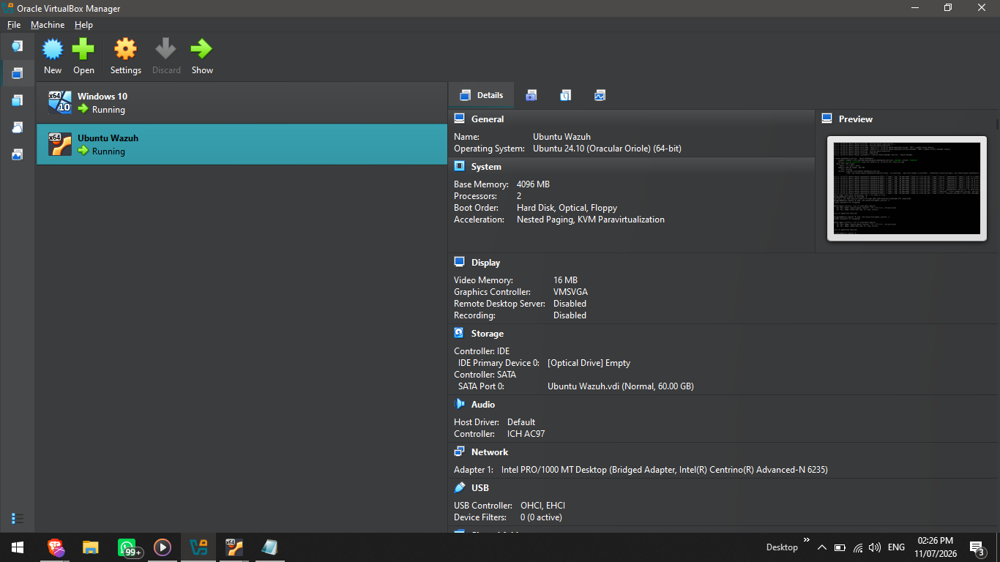
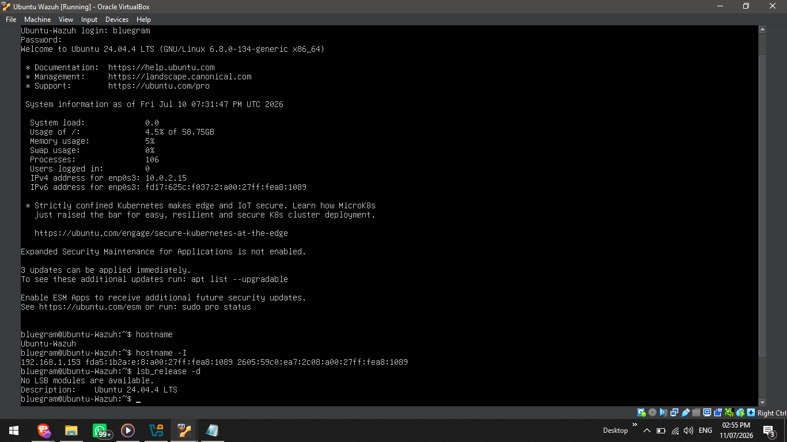
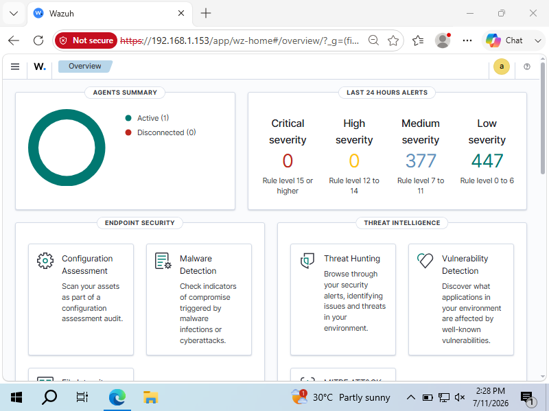
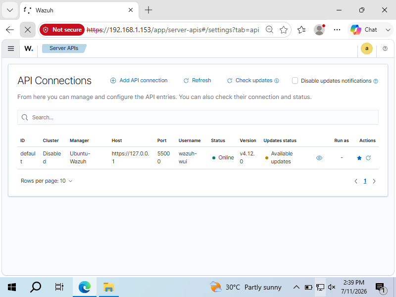
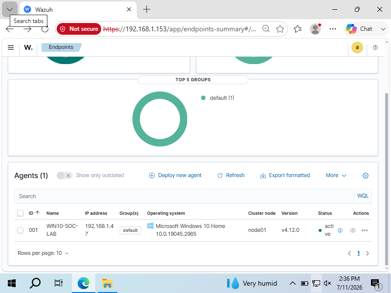
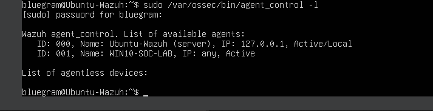

# Wazuh SIEM Home Lab

> **Status:** 🟢 Active Development (30-Day SOC Analyst Home Lab Challenge)

A hands-on Security Information and Event Management (SIEM) home lab built using **Wazuh**, **Ubuntu Server 24.04 LTS**, **Windows 10**, and **Oracle VirtualBox**.

This project demonstrates the deployment, configuration, and operation of a SIEM platform for monitoring endpoints, collecting security events, investigating alerts, and developing practical SOC Analyst skills through real-world lab exercises.

---

# Project Objectives

- Deploy a Wazuh SIEM server from scratch.
- Configure Ubuntu Server as the Wazuh Manager.
- Install and enroll a Windows 10 endpoint agent.
- Monitor endpoint activity using the Wazuh Dashboard.
- Investigate security events and alerts.
- Practice SOC Analyst workflows.
- Document the entire process in a professional GitHub portfolio.

---

# Lab Environment

| Component | Technology |
|-----------|------------|
| SIEM Platform | Wazuh 4.12 |
| Server Operating System | Ubuntu Server 24.04 LTS |
| Endpoint Operating System | Windows 10 |
| Virtualization | Oracle VirtualBox |
| Network Configuration | Bridged Adapter |

---

# Skills Demonstrated

- SIEM Deployment
- Ubuntu Linux Administration
- Windows Endpoint Monitoring
- Wazuh Agent Management
- Log Collection
- Network Configuration
- Virtualization
- Security Monitoring
- Troubleshooting
- Technical Documentation

---

# Screenshots

## 1. Virtual Lab Environment

The complete VirtualBox lab consisting of an Ubuntu Wazuh Server and a Windows 10 endpoint.

---

## 2. Ubuntu Wazuh Server

Ubuntu Server successfully configured with Wazuh Manager and connected to the network.

---

## 3. Wazuh Dashboard

Successful login to the Wazuh Dashboard after completing the installation and configuration.

---

## 4. Wazuh API Status

Verification that the Wazuh API is online and successfully communicating with the Dashboard.

---

## 5. Windows Endpoint Successfully Enrolled

The Windows 10 endpoint successfully enrolled and reporting to the Wazuh Manager.

---

## 6. Agent Verification from the Server

Verification from the Ubuntu Server confirming that both the Wazuh Manager and Windows endpoint are active.

---

# Project Status

- ✅ Oracle VirtualBox Lab Created
- ✅ Ubuntu Server Installed
- ✅ Wazuh Manager Installed
- ✅ Wazuh Dashboard Configured
- ✅ Windows 10 Endpoint Connected
- ✅ Wazuh Agent Successfully Enrolled
- ✅ Agent Communication Verified
- 🔄 Security Monitoring (In Progress)
- 🔄 Alert Investigation (Upcoming)
- 🔄 Threat Hunting (Upcoming)
- 🔄 Incident Response (Upcoming)

---

# Learning Goals

This project is part of a structured 30-day SOC Analyst learning journey focused on building practical cybersecurity skills through hands-on experience.

Upcoming activities include:

- Security Event Monitoring
- Log Analysis
- MITRE ATT&CK Mapping
- Threat Hunting
- Brute Force Detection
- Malware Detection
- Windows Event Log Analysis
- Incident Investigation
- Custom Detection Rules
- Security Reporting

---

# Author

**Femi Sanya (Bluegram)**

Aspiring SOC Analyst | Cybersecurity Enthusiast

GitHub: https://github.com/femisanya-femi

---

**Thank you for visiting this project!**

This repository will continue to grow as more security monitoring, detection engineering, threat hunting, and incident response scenarios are completed throughout the 30-day SOC Analyst Home Lab challenge.
